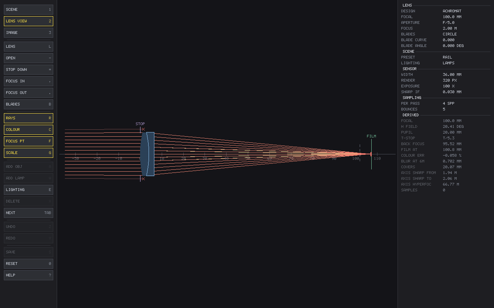
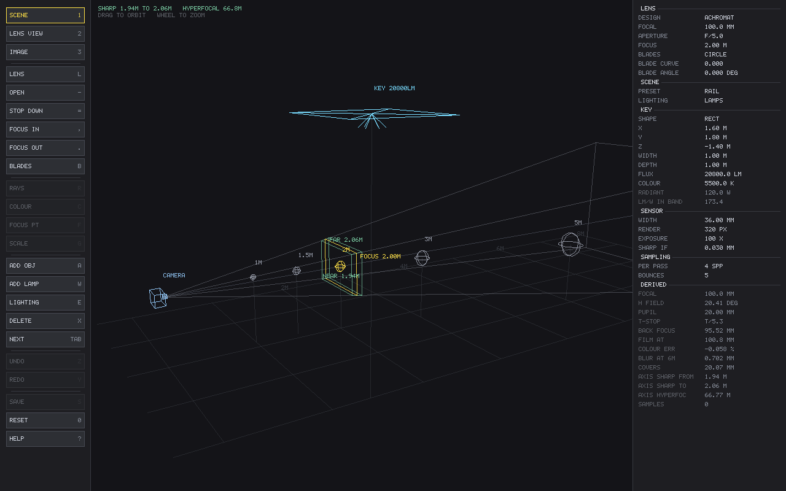
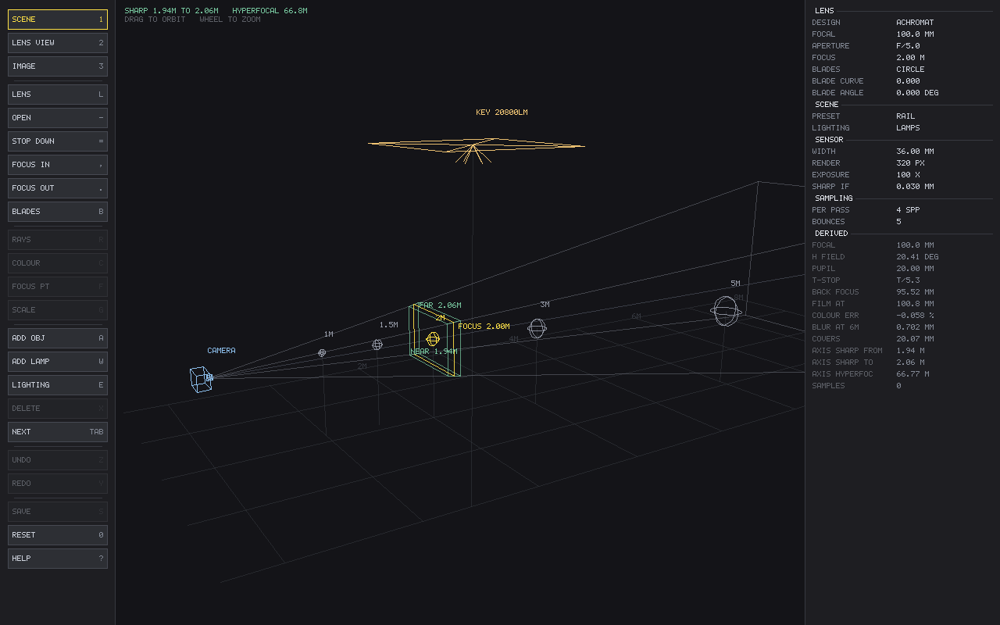
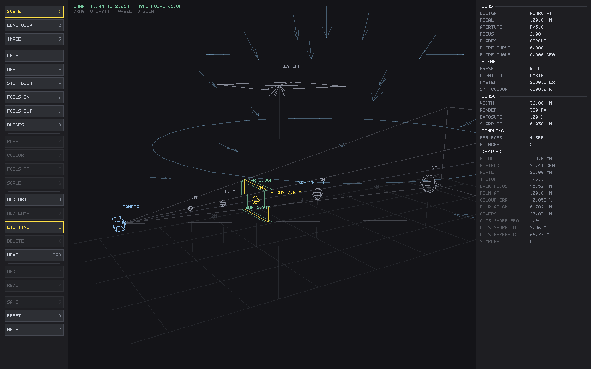
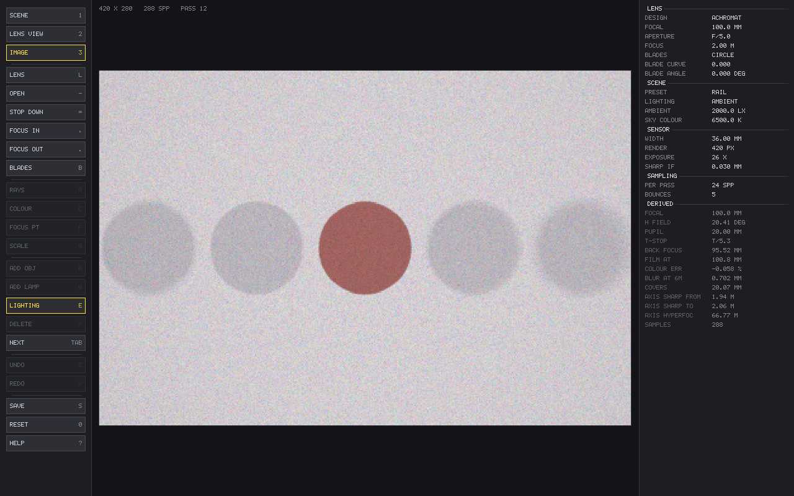
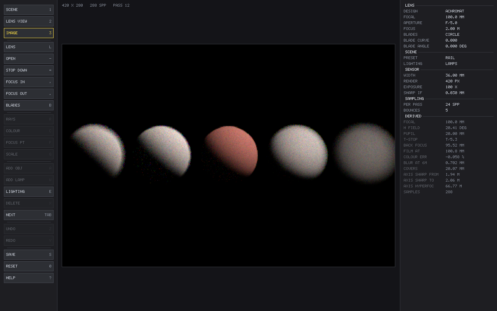
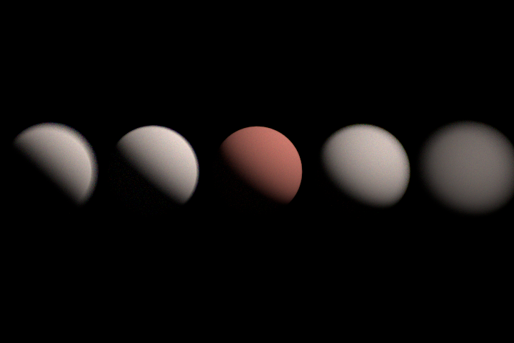
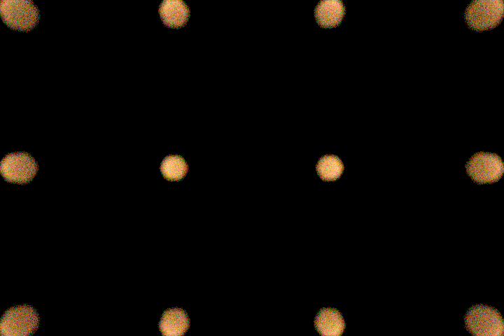

# Optics-Simulation

A physically-based camera simulator. Focal length, aperture, gain and shutter speed are real
physical controls, and the image is what that camera actually records — including while the
camera and its subjects are moving.

Light is traced through **multi-element lens prescriptions**, surface by surface, with a
per-wavelength refractive index. Spherical aberration, coma, astigmatism, field curvature,
chromatic aberration, vignetting, distortion and aperture-shaped bokeh are not effects that get
applied — they are what happens when you trace real glass.



*A 100 mm Fraunhofer doublet at f/5, traced at the F, d and C lines. Generated by
the app itself — `make docs-images` regenerates it, so the picture cannot drift
from the code that made it.*

## Build

Needs a C11 compiler and, for the viewer only, SDL2.

```sh
make            # one binary: opticsim
make test       # the architectural gates, then the suites
make debug      # -O0 -g3
make test-asan  # address + undefined behaviour sanitizers
make test-ubsan
```

There is nothing to install and no package manager. `brew install sdl2` (or
`apt install libsdl2-dev`) for the viewer; without it the same binary still
builds and runs, and says it has no window rather than failing to compile.

## Run it

```sh
./opticsim
```

That is the whole thing. One binary, no arguments: it opens the viewer, and
**every setting is a control** — the lens design, focal length, aperture,
focus, iris blades and their curvature and angle, the sensor width, the render
resolution, exposure, samples per pass and bounce depth. Drag a row in the
right-hand panel to change it, or click it and type a number.

**The scene is one of those settings.** Click an object or a lamp in the scene
view to select it, drag to slide it along the ground (hold shift for height),
and type exact coordinates when a target has to sit at exactly 2.000 m. `A`
adds an object, `W` adds a lamp, `X` deletes the selection and `TAB` steps
through everything. A lamp's brightness is set in **lumens** — the number
printed on a real bulb — with the radiant watts and the in-band efficacy shown
beside it.

**Every change can be taken back.** `Z` undoes, `Y` redoes. A whole drag is one
step rather than one per pixel, and so is a run of arrow-key nudges — a step is
a *gesture*, not a settings change. Which view you are looking at is not a
change and is never undone: taking back an aperture edit while you are in the
lens view leaves you in the lens view. `RESET` is undoable like anything else,
which is the case that matters most.

There is **no backdrop and no walls** — the subjects stand in empty space, and
what is behind them is whatever the lighting says is behind them: nothing under
lamps, the sky itself under a dome. A wall bounces light back onto the
subjects, occludes the sky behind them, and gives every silhouette a second
edge to be confused with the first. Add an object and set its `SHAPE` to
`PLANE` when a scene wants one.

**Or no lamps at all.** `E` switches the lighting between the placed lamps and a
uniform dome of light arriving from every direction — an overcast sky, or the
inside of a lightbox. It is authored as the illuminance a surface facing it
receives, in **lux**, which is what a light meter reads. The dome casts no
shadows and leaves no terminators, and that is the point: a hard shadow edge
reads as sharpness to the eye whether the lens is focused or not, so flat
lighting is the honest place to judge focus. The two are a choice, not a
blend — under the dome the lamps are off, and the scene view says so.

Three views: `1` shows **where everything is** — the camera, the cone it sees,
the focus plane and the depth of field, with the subjects at their true
distances (drag to orbit). `2` shows **how the glass bends light**. `3` shows
**what came out**. All three read the same lens and the same stage, so they
cannot disagree.

The image refines while you leave it alone and starts over the moment a setting
changes — except exposure, which is a view gain and does not throw away a
half-converged render.

The same binary is a batch tool when given a command:

```sh
./opticsim still --stage rail --fstop 5 --focus 2.0   # a frame to a file
./opticsim still --ambient 2000                       # lit by a 2000 lx dome
./opticsim glass                                      # the dispersion catalogue
./opticsim spectrum                                   # the spectral band
./opticsim --help
```

## Status

Under construction, milestone by milestone. Every milestone leaves `make && make test` green.

| | | |
|---|---|---|
| M0 | build, gates, test harness | done |
| M1 | vendored spectral/colour/geometry core | done |
| M2 | glass: Sellmeier dispersion, model glasses | done |
| M3 | prescriptions, paraxial analysis | done |
| M4 | real sequential ray tracing, iris, focus | done |
| M5 | **SDL viewer with the lens cross-section** | done |
| M6 | exit-pupil sampling, camera ray generation | done |
| M7 | hero-wavelength renderer — **first image** | done |
| M8 | procedural test stage | done |
| M9 | sensor: exposure triangle, noise — **first photograph** | next |
| M10 | diffraction and starbursts | |
| M11 | ghosts and veiling flare | |
| M12 | motion, rolling shutter | |
| M13 | real photographic prescriptions | |
| M14 | generated documentation images, CI | |
| M15 | slanted-edge MTF | |

The viewer was pulled ahead of the renderer on purpose. A lens cross-section is
the best debugging tool a sequential ray tracer has: a flipped radius sign, a
mis-set stop or a wrong intersection root are obvious in a diagram and
completely invisible in a focal length printed to four decimals. Every ray it
draws comes out of the same `os_lens_trace_path()` the renderer will use, so
the picture can be trusted when the image looks wrong.

What works today:

`still` writes a PPM, and `--pfm` additionally writes the film in raw physical
units — which is what the measurements are made from. Measuring optics off an
8-bit tone-mapped image measures the tone map: a fixed brightness threshold
picks out a different fraction of a blur disc depending on how concentrated the
light is, so the same lens appears to have a different circle of confusion at
every aperture.



*A lamp selected. Its position, size, flux and colour temperature are editable;
the watts and the efficacy follow from them. Changing the colour temperature
leaves the lumens where they are — a 20 800 lm lamp stays a 20 800 lm lamp,
which is what anyone adjusting a colour means.*



*The camera and its subjects from outside: the cone the sensor sees, the plane
it is focused on, and the slab either side of that which is still sharp. The
one target inside it is picked out in yellow. At f/5 on a 100 mm lens focused at
2 m that slab is **1.94 m to 2.06 m** — which is what the century-old hyperfocal
formulae say, and the tests check it against them.*



*The same scene lit by a uniform dome instead. There is no position to draw,
because a uniform sky does not have one — so it is drawn as light arriving from
every direction rather than as a wireframe hemisphere at some invented radius.
The lamp is still there, still draggable, and marked `OFF`.*



*What that records. Nothing casts a shadow and nothing has a terminator, so the
only thing separating the five targets is how far out of focus they are — and
the middle one, at 2 m, is plainly the sharp one. Every target is darker than
the sky behind it, because a Lambertian surface returns rho times what falls on
it and rho is less than one.*



*One binary, one window. Every setting on the right is editable; the render
refines while you leave it alone. Generated by the app itself — `make
docs-images` regenerates every picture here, so none of them can drift from the
code that made it.*



*Five identical targets at 1.0, 1.5, 2.0, 3.0 and 5.0 m, focused on the middle
one at f/5. Each subtends the same angle, so the only difference between them in
the frame is how far out of focus they are.*



*Lamps at 6 m, focused at 1.2 m, through a six-blade iris. The warm cast is a
3000 K blackbody carried through the spectral pipeline; the corner discs are
elongated because off-axis bundles clip on the edges of the glass. Neither is
drawn — both fall out of tracing the aperture.*

In the viewer, `L` swaps the singlet for the achromat and the panel's COLOUR
ERR row goes from **-1.542 %** to **-0.058 %**: that is the Fraunhofer
condition doing its job, and nothing in the code special-cases it. `?` lists
every key.

For a window-free machine, `./opticsim-view --capture <subject> <dir>` runs the
real draw path into a hidden software renderer and writes a BMP. Subjects:
`wide singlet achromat stopped blades`.

## Design

Three ideas do most of the work.

**Depth of field is an on-axis idea, and the panel says so.** The familiar
near/far/hyperfocal figures model *defocus* — how far an out-of-plane subject's
image lands from the film. That is the whole story on the optical axis and
badly incomplete off it. A simple doublet has no correction for coma,
astigmatism or field curvature, and by ten millimetres of field they dominate.
Focused at 4.57 m this lens puts a subject at 5 m in the dead centre of its
depth of field, yet 13.7 mm off axis it blurs to **0.48 mm** while a subject at
3 m — supposedly well outside the band — comes to **0.09 mm** at 6.9 mm off
axis. Move that same 5 m subject onto the axis and it sharpens to 0.05 mm, which
is what identifies the cause as field rather than distance. So anything claiming
a subject is sharp asks `os_lens_spot_mm()`, which traces the real spot at the
subject's real field position; the paraxial band is still reported, labelled
`AXIS SHARP FROM/TO`.

**Brightness comes from the exposure triangle and from nowhere else.** There is no
auto-exposure anywhere in the camera path. The vendored film writer had a 99th-percentile
stretch; it was deleted rather than disabled, because an image that silently renormalises
itself looks correctly exposed no matter how wrong the f-number, shutter and ISO are, and that
would make the entire simulation decorative.

**Dispersion is confined to the lens.** Every scene material stays non-dispersive, so the
borrowed transport core keeps its all-wavelengths-at-once optimisation. But a ray leaving the
rear element at 450 nm and one at 650 nm from the same sensor point are *different rays*, so
each camera path carries exactly one hero wavelength. Carrying all 95 bins down one of them is
precisely how you would erase the chromatic aberration the lens exists to produce.

### Invariants the build enforces

Four `grep` gates run before every test. Each guards a bug whose symptom is *a picture that
looks right*, which is the only kind worth spending a build step on.

| gate | what it refuses |
|---|---|
| `check-exposure-purity` | auto-exposure outside the display layer |
| `check-lens-purity` | dispersion escaping the lens layer into the transport core |
| `check-sdl-purity` | SDL reaching any module the headless tests link |
| `check-scale-purity` | the sensor seeing the render grid instead of the photosite |

They match code, not prose: a line whose first non-space character is `*` or `/` is skipped, so
explaining *why* auto-exposure was removed does not trip the gate that removed it.

### Borrowed code

The renderer core is vendored from the sibling [Light-Simulation](../Light-Simulation) — MIT,
same author — rather than rewritten: spectra, CIE colour, geometry, BVH meshes, BSDFs, lights,
scene traversal, film and threading. Every borrowed file carries a provenance banner naming the
commit it came from and exactly what was changed, and `check-vendor` fails the build if one
does not. The prefix says which is which: `ls_` is borrowed and proven, `os_` is written here.

The light-transport integrator is deliberately *not* borrowed. It returns all 95 spectral bins,
and hero-wavelength sampling uses one — so the scalar tracer is written fresh instead of
vendored and then forked.

## Licence

MIT.
