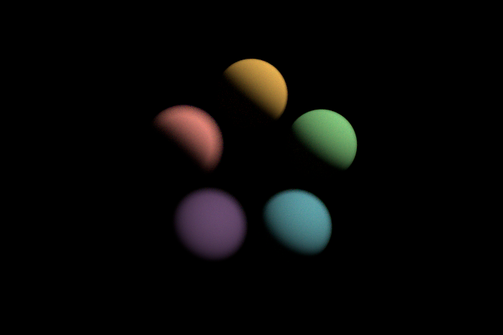
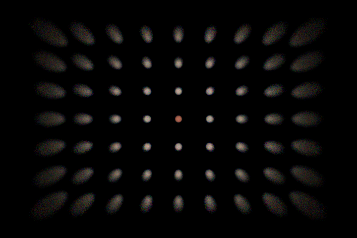
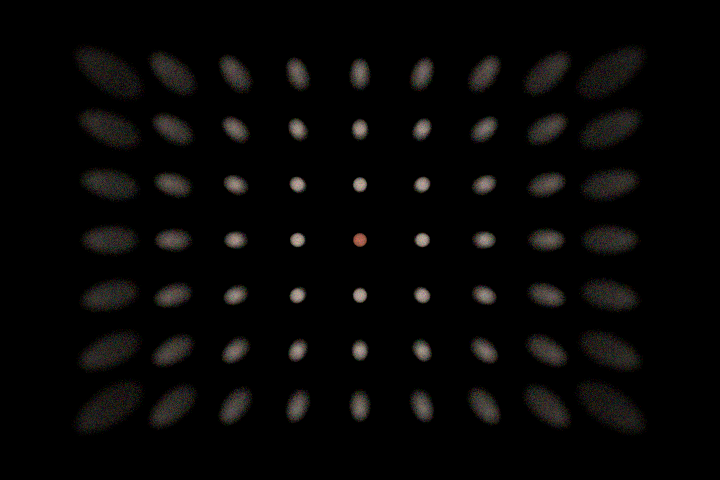
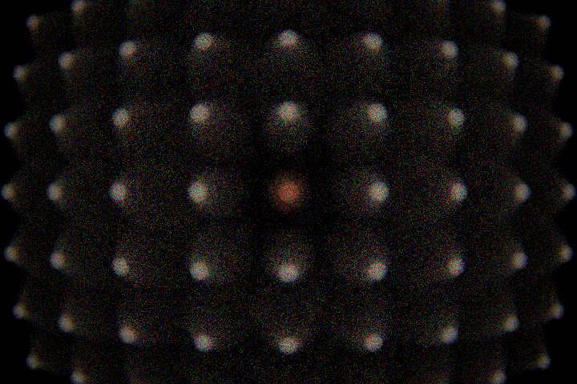

# Optics-Simulation

A physically-based camera simulator. Focal length, aperture, gain and shutter speed are real
physical controls, and the image is what that camera actually records — including while the
camera and its subjects are moving.

Light is traced through **multi-element lens prescriptions**, surface by surface, with a
per-wavelength refractive index. Spherical aberration, coma, astigmatism, field curvature,
chromatic aberration, vignetting, distortion and aperture-shaped bokeh are not effects that get
applied — they are what happens when you trace real glass.


*A 100 mm Fraunhofer doublet at f/5, traced at the F, d and C lines. Generated by
the app itself — `make docs-images` regenerates it, so the picture cannot drift
from the code that made it.*

## Build

Needs a C11 compiler and, for the viewer only, SDL2.

```sh
make            # one binary: opticsim
make test       # the architectural gates, then the suites
make debug      # -O0 -g3
make test-asan  # address + undefined behaviour sanitizers
make test-ubsan
```

There is nothing to install and no package manager. `brew install sdl2` (or
`apt install libsdl2-dev`) for the viewer; without it the same binary still
builds and runs, and says it has no window rather than failing to compile.

## Run it

```sh
./opticsim
```

That is the whole thing. One binary, no arguments: it opens the viewer, and
**every setting is a control** — the lens design, focal length, aperture,
focus, iris blades and their curvature and angle, the sensor width, the render
resolution, exposure, samples per pass and bounce depth. Drag a row in the
right-hand panel to change it, or click it and type a number.

**The scene is one of those settings.** Click an object or a lamp in the scene
view to select it, drag to slide it along the ground (hold shift for height),
and type exact coordinates when a target has to sit at exactly 2.000 m. `A`
adds an object, `W` adds a lamp, `X` deletes the selection and `TAB` steps
through everything. A lamp's brightness is set in **lumens** — the number
printed on a real bulb — with the radiant watts and the in-band efficacy shown
beside it.

**Every change can be taken back.** `Z` undoes, `Y` redoes. A whole drag is one
step rather than one per pixel, and so is a run of arrow-key nudges — a step is
a *gesture*, not a settings change. Which view you are looking at is not a
change and is never undone: taking back an aperture edit while you are in the
lens view leaves you in the lens view. `RESET` is undoable like anything else,
which is the case that matters most.

There is **no backdrop and no walls** — the subjects stand in empty space, and
what is behind them is whatever the lighting says is behind them: nothing under
lamps, the sky itself under a dome. A wall bounces light back onto the
subjects, occludes the sky behind them, and gives every silhouette a second
edge to be confused with the first. Add an object and set its `SHAPE` to
`PLANE` when a scene wants one.

**Or no lamps at all.** `E` switches the lighting between the placed lamps and a
uniform dome of light arriving from every direction — an overcast sky, or the
inside of a lightbox. It is authored as the illuminance a surface facing it
receives, in **lux**, which is what a light meter reads. The dome casts no
shadows and leaves no terminators, and that is the point: a hard shadow edge
reads as sharpness to the eye whether the lens is focused or not, so flat
lighting is the honest place to judge focus. The two are a choice, not a
blend — under the dome the lamps are off, and the scene view says so.

Three views: `1` shows **where everything is** — the camera, the cone it sees,
the focus plane and the depth of field, with the subjects at their true
distances (drag to orbit). `2` shows **how the glass bends light**. `3` shows
**what came out**. All three read the same lens and the same stage, so they
cannot disagree.

The image refines while you leave it alone and starts over the moment a setting
changes — except exposure, which is a view gain and does not throw away a
half-converged render.

The same binary is a batch tool when given a command:

```sh
./opticsim still --stage rail --fstop 5 --focus 2.0   # a frame to a file
./opticsim still --stage ring --fstop 5 --focus 5.0   # the controlled layout
./opticsim still --stage bokeh --focus 1.2            # a field of depth
./opticsim still --stage grid --lens singlet --focal 24  # distortion
./opticsim still --lens zoom --focal 45               # groups, not scaling
./opticsim still --ambient 800                        # lit by a uniform dome
./opticsim glass                                      # the dispersion catalogue
./opticsim spectrum                                   # the spectral band
./opticsim --help
```

## Status

Under construction, milestone by milestone. Every milestone leaves `make && make test` green.

| | | |
|---|---|---|
| M0 | build, gates, test harness | done |
| M1 | vendored spectral/colour/geometry core | done |
| M2 | glass: Sellmeier dispersion, model glasses | done |
| M3 | prescriptions, paraxial analysis | done |
| M4 | real sequential ray tracing, iris, focus | done |
| M5 | **SDL viewer with the lens cross-section** | done |
| M6 | exit-pupil sampling, camera ray generation | done |
| M7 | hero-wavelength renderer — **first image** | done |
| M8 | procedural test stage | done |
| M9 | sensor: exposure triangle, noise — **first photograph** | next |
| M10 | diffraction and starbursts | |
| M11 | ghosts and veiling flare | |
| M12 | motion, rolling shutter | |
| M13 | real photographic prescriptions | |
| M14 | generated documentation images, CI | |
| M15 | slanted-edge MTF | |

The viewer was pulled ahead of the renderer on purpose. A lens cross-section is
the best debugging tool a sequential ray tracer has: a flipped radius sign, a
mis-set stop or a wrong intersection root are obvious in a diagram and
completely invisible in a focal length printed to four decimals. Every ray it
draws comes out of the same `os_lens_trace_path()` the renderer will use, so
the picture can be trusted when the image looks wrong.

What works today:

`still` writes a PPM, and `--pfm` additionally writes the film in raw physical
units — which is what the measurements are made from. Measuring optics off an
8-bit tone-mapped image measures the tone map: a fixed brightness threshold
picks out a different fraction of a blur disc depending on how concentrated the
light is, so the same lens appears to have a different circle of confusion at
every aperture.


*A lamp selected. Its position, size, flux and colour temperature are editable;
the watts and the efficacy follow from them. Changing the colour temperature
leaves the lumens where they are — a 20 800 lm lamp stays a 20 800 lm lamp,
which is what anyone adjusting a colour means.*


*The camera and its subjects from outside: the cone the sensor sees, the plane
it is focused on, and the slab either side of that which is still sharp. The
one target inside it is picked out in yellow. At f/5 on a 100 mm lens focused at
2 m that slab is **1.94 m to 2.06 m** — which is what the century-old hyperfocal
formulae say, and the tests check it against them.*


*The same scene lit by a uniform dome instead. There is no position to draw,
because a uniform sky does not have one — so it is drawn as light arriving from
every direction rather than as a wireframe hemisphere at some invented radius.
The lamp is still there, still draggable, and marked `OFF`.*


*What that records. Nothing casts a shadow and nothing has a terminator, so the
only thing separating the five targets is how far out of focus they are — and
the middle one, at 2 m, is plainly the sharp one. The dome lights them and is
not photographed: a camera ray that hits nothing comes back black, so the
background stays black in both lighting modes. It has to, because a dome bright
enough to light a scene outshines everything it lights — rho is below one — and
in shot it would fill most of the frame, drive the exposure, and leave no
setting at which the subjects are right and the background is not clipped
white.*


*One binary, one window. Every setting on the right is editable; the render
refines while you leave it alone. Generated by the app itself — `make
docs-images` regenerates every picture here, so none of them can drift from the
code that made it.*


*Five targets at 1.0, 1.5, 2.0, 3.0 and 5.0 m in a row, focused on the middle
one at f/5. Each subtends the same angle and each reflects the same 0.48 of the
light falling on it — they differ in hue so they can be told apart, and in
nothing else, because the eye reads brightness as sharpness readily enough to
confuse the one thing this scene is for.*



*The same five distances, the same colours, the same focus and aperture — moved
onto a ring at one angular radius. This is the controlled version, and the
difference is not cosmetic. Depth of field is an on-axis, defocus-only idea,
while every other aberration grows with how far off the axis a subject sits, so
a row measures focus and field position at once: focused at 5 m, the row's 5 m
target images 0.45 mm across while its 3 m target images 0.11 mm, and the focus
dial does not pick out the sharp one. Put all five at the same field radius and
that error is identical for all of them and cancels; focusing on each in turn
now makes it the sharpest thing in frame, five times out of five against the
row's four. Press `PRESET` in the viewer to switch between them.*


*Seventeen objects from 0.55 m to 14 m, focused at 1.2 m, at f/5. One thin
layer is sharp and everything else is not, so the blur can be watched growing
in both directions from it — the foreground at 0.55 m is blurred on the near
side of focus, the far objects on the other — and dimming as it goes, because
illuminance falls as one over r squared and nothing here pretends otherwise.
Past about 10 m the blur has stopped growing: an object at infinity images a
fixed distance from the focused one, so extra depth beyond that buys darkness
rather than softness, and the deepest three are there to sit on the far side of
that knee. Sizes span 20× in metres and 5× as the frame sees them. Four lamps
light it, all of them outside the frame — the only thing separating a light
from a subject here is placement, and they are hung high enough to stay outside
it at every focal length the viewer offers rather than only at this one.*

*Another thirty-two sit further out, from 0.22 to 0.80 radians off the axis,
which is past the edge of this frame entirely. They are there for the other end
of the zoom: a 100 mm lens sees ±0.18 rad, a 24 mm one sees ±0.75, so a scene
composed only for the long end turns into a small huddle in the middle of a lot
of black as soon as the lens goes wide. Those are placed on a sunflower spiral
rather than by hand — even coverage, no clumping, and nobody studies the
arrangement of a periphery.*

*This scene used to be ten small bright lamps whose out-of-focus images took
the shape of the iris. That is the other half of the subject and the shape is
real, but it is only visible in a HIGHLIGHT — a source small and bright enough
to clip has an edge hard enough to show a polygon, and an ordinary surface does
not. The iris is still checked, on the pupil itself, in the tests.*



*Nine by seven dots on one plane, evenly spaced in metres — so they are
collinear, and a rectilinear lens would image them collinear. This is the
singlet at 24 mm, and its rows bow: **−2.1 %** at the corner, barrel. Distortion
is the one aberration here that blurs nothing. It moves an image point instead
of spreading it, so it cannot be seen in a spot diagram and it cannot be seen on
a field of round objects — a blob moved slightly outward is still a blob. It
takes points that ought to be straight. The radial smearing of the outer dots is
a separate defect: that is astigmatism and field curvature, and at 24 mm this
lens covers a 4.8 mm image circle on a 43 mm frame.*



*The same chart, same focus, same focal length, one design apart: **−0.45 %**.
Nearly straight. The panel carries the figure as a `DISTORTION` row beside
`COLOUR ERR`, because both are the same kind of thing — an aberration reduced to
one signed number, so that swapping the design moves it visibly instead of
requiring a squint. Positive is pincushion, negative barrel.*

*The number is measured from the chief ray against the paraxial image height **at
the distance the lens is focused at**, which matters more than it sounds:
`f·tan θ` is the infinite-conjugate formula, and using it on a lens focused at
2 m reports about +3 % of pincushion on a design that has half a per cent of
barrel. Right magnitude, wrong sign, entirely convincing.*



*The same chart through `ZOOM`, the one design here whose **focal length moves
glass**. Every other prescription reaches another focal length by scaling —
multiply every length by k and you have a real lens of the same form, with every
angle and therefore every aberration unchanged. A zoom is not that: two
achromatic doublets with the stop between them, and the separation between them
sets the focal length. Solved by bisection against the paraxial trace, because
the groups are 6.5 mm of glass each and the thin-lens identity they were derived
from is 14 % out at the long end.*

*So the design genuinely changes as you dial it, and the numbers move with it:*

| focal | total track | distortion | colour err |
|---|---|---|---|
| 100 mm | 55.1 mm | −4.3 % | −0.692 % |
| 80 mm | 62.1 mm | −6.9 % | −0.696 % |
| 60 mm | 73.8 mm | −12.9 % | −0.701 % |
| 45 mm | 89.3 mm | −23.6 % | −0.704 % |

*The 45 mm setting is the **longer** lens — the groups separate as it goes
wide — which nothing that merely rescales can do. Distortion sweeps 5.5×. The
colour error, which I expected to sweep too, does not: each group is achromatic
on its own, so what is left is their own secondary spectrum, and that travels
with the glass rather than with the gap. Its level is another matter — −0.70 %
against the achromat's −0.058 %, because the two groups carry far more power
than their sum.*

*It runs 45–100 mm and refuses outside that, and both ends are measured rather
than chosen. The long end is mechanical: closer than 6 mm of separation the
groups collide. The wide end is optical, and it is the reason there is no
fisheye in this repo — a retrofocus puts its entrance pupil **behind** the front
element, 27 mm behind here, so that element's clear aperture caps the field at
atan(24.7/26.9) = 42°. Past 45 mm the frame corner asks for more than that and
vignettes. Splitting the front group into weaker elements does not help: each
radius grows, so each aperture can, but the extra glass pushes the front vertex
away by the same proportion and the ratio that sets the field never moves. Real
wide-angles pull the pupil forward with a multi-element negative group whose
bendings are optimised, not derived — and optimisation is what this file does
not have.*

In the viewer, `L` swaps the singlet for the achromat and the panel's COLOUR
ERR row goes from **-1.542 %** to **-0.058 %**: that is the Fraunhofer
condition doing its job, and nothing in the code special-cases it. `?` lists
every key.

For a window-free machine, `./opticsim-view --capture <subject> <dir>` runs the
real draw path into a hidden software renderer and writes a BMP. Subjects:
`wide singlet achromat stopped blades`.

## Design

Three ideas do most of the work.

**Depth of field is an on-axis idea, and the panel says so.** The familiar
near/far/hyperfocal figures model *defocus* — how far an out-of-plane subject's
image lands from the film. That is the whole story on the optical axis and
badly incomplete off it. A simple doublet has no correction for coma,
astigmatism or field curvature, and by ten millimetres of field they dominate.
Focused at 4.57 m this lens puts a subject at 5 m in the dead centre of its
depth of field, yet 13.7 mm off axis it blurs to **0.48 mm** while a subject at
3 m — supposedly well outside the band — comes to **0.09 mm** at 6.9 mm off
axis. Move that same 5 m subject onto the axis and it sharpens to 0.05 mm, which
is what identifies the cause as field rather than distance. So anything claiming
a subject is sharp asks `os_lens_spot_mm()`, which traces the real spot at the
subject's real field position; the paraxial band is still reported, labelled
`AXIS SHARP FROM/TO`.

**Brightness comes from the exposure triangle and from nowhere else.** There is no
auto-exposure anywhere in the camera path. The vendored film writer had a 99th-percentile
stretch; it was deleted rather than disabled, because an image that silently renormalises
itself looks correctly exposed no matter how wrong the f-number, shutter and ISO are, and that
would make the entire simulation decorative.

**Dispersion is confined to the lens.** Every scene material stays non-dispersive, so the
borrowed transport core keeps its all-wavelengths-at-once optimisation. But a ray leaving the
rear element at 450 nm and one at 650 nm from the same sensor point are *different rays*, so
each camera path carries exactly one hero wavelength. Carrying all 95 bins down one of them is
precisely how you would erase the chromatic aberration the lens exists to produce.

### Invariants the build enforces

Six `grep` gates run before every test. Each guards a bug whose symptom is *a picture that
looks right*, which is the only kind worth spending a build step on.

| gate | what it refuses |
|---|---|
| `check-exposure-purity` | auto-exposure outside the display layer |
| `check-lens-purity` | dispersion escaping the lens layer into the transport core |
| `check-sdl-purity` | SDL reaching any module the headless tests link |
| `check-scale-purity` | the sensor seeing the render grid instead of the photosite |
| `check-photometry-purity` | a lumen anywhere but where lights are authored |
| `check-vendor` | a borrowed file without its provenance banner |

They match code, not prose: a line whose first non-space character is `*` or `/` is skipped, so
explaining *why* auto-exposure was removed does not trip the gate that removed it. Exemptions
are named files rather than loosened patterns, so the next one has to be argued for too.

[`CLAUDE.md`](CLAUDE.md) collects these alongside the per-module invariants, the conventions
this codebase expects, and the four commands to run before pushing.

### Borrowed code

The renderer core is vendored from the sibling [Light-Simulation](../Light-Simulation) — MIT,
same author — rather than rewritten: spectra, CIE colour, geometry, BVH meshes, BSDFs, lights,
scene traversal, film and threading. Every borrowed file carries a provenance banner naming the
commit it came from and exactly what was changed, and `check-vendor` fails the build if one
does not. The prefix says which is which: `ls_` is borrowed and proven, `os_` is written here.

The light-transport integrator is deliberately *not* borrowed. It returns all 95 spectral bins,
and hero-wavelength sampling uses one — so the scalar tracer is written fresh instead of
vendored and then forked.

## Licence

MIT.
